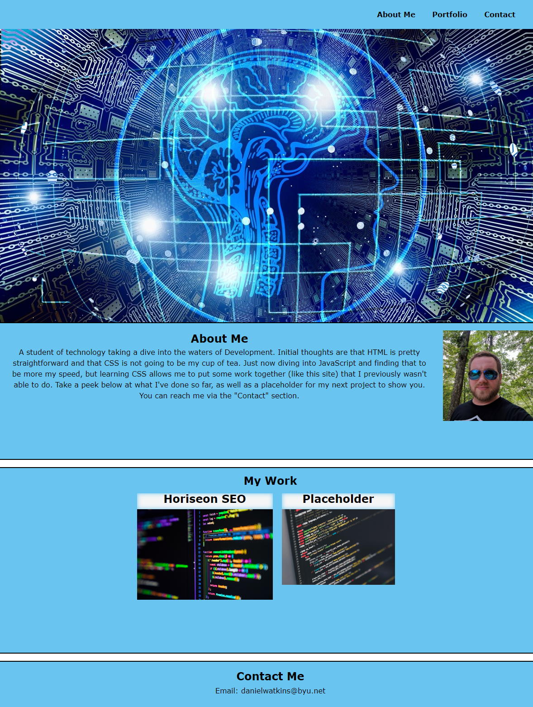

# personal-development-portfolio
personal-development-portfolio

## Description
Link: https://dan-watkins.github.io/personal-development-portfolio/ 

This is my personal Development Portfolio site. As I continue learning and creating applications the site will be updated to include my latest work, as well as ways to contact me should you want to reach out.

## Installation
Simply clone the repository. The current project is deployed using GitHub pages, which you will need to do as well.

* In the Settings for your respoitory scroll down to the 'Code and automation' section and find 'Pages.'

* Branch should be 'main.' Save.

* This step may take a moment to generate the page URL. Be patient.

* Once Page build and deploy is complete you should be able to access the site via <your-github-username.github.io/your-repository-name>.

## Credits
Credit to Adham Dannaway, whose portfolio was an inspiration for the layout I used. While not very close his site serves as the end goal I would have for how my own portfolio would eventually appear.

https://arc.dev/developer-blog/web-developer-portfolio/